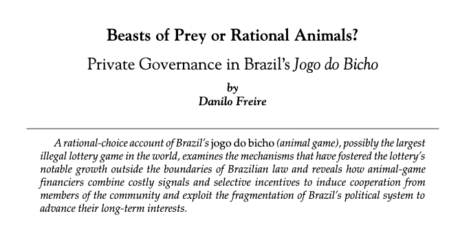

```{r setup, include=FALSE}
options(htmltools.dir.version = FALSE)
```
class: inverse, center, middle

# Hello everyone! :)

<html><div style='float:left'></div><hr color='#EB811B' size=1px width=800px></html> 

---

# About me

.font180[**Danilo Freire**]

.font120[
* Eu sou brasileiro

* Masters from the Graduate Institute Geneva

* PhD in Political Economy at King's College London

* Postdoctoral Research Associate in the Political Theory Project at Brown University

* Political violence, collective action, public service provision, experimental methods, machine learning

* [http://danilofreire.github.io](http://danilofreire.github.io)
* [danilofreire@gmail.com](mailto:danilofreire@gmail.com)
]

---

class: clear

background-image: url(beach.jpg)

---

class: clear

background-image: url(caipirinha.webp)

---

class: clear

background-image: url(carnaval.jpg)

---

class: clear

background-image: url(neymar.jpg)

---

class: clear

.center[]

---

class: inverse, center, middle

# Studies in non-market decision-making

<html><div style='float:left'></div><hr color='#EB811B' size=1px width=800px></html> 

---

# Public choice

.center[]

---

# Public choice

.center[]

---

# Edward Stringham

.center[]

---

# David Skarbek

.center[]

---

# Myself

.center[]

---

# Peter Leeson

.center[]

---

# The Invisible Hook

.center[]

---

# Pirational choice


---

# An-arrgh-chy

.center[]

---

class: inverse, center, middle

# The political economy of piracy

<html><div style='float:left'></div><hr color='#EB811B' size=1px width=800px></html> 

---

# Not these pirates...

.center[]

---

# ...but these ones!

.center[]

---

# Pirate governance

.font140[
* Pirates are known for their raucousness and chaotic rapine

* Pirate reality, however, is much different from that

* Pirate ships had democratically-elected captains and quartermasters

* Pirates implemented checks and balances before any country in the world, including Great Britain

* Their internal governance mechanisms remain understudied
]

---

# Pirate governance

.font140[
* Self-enforcing governance by design 

* Informal rules

* Written constitutions

* Emergent order
]

---

class: inverse, center, middle

# A nest of rogues?

<html><div style='float:left'></div><hr color='#EB811B' size=1px width=800px></html> 

---

# A nest of rogues?

.font140[
* "Golden age" of piracy: 1690 to 1730

* Blackbeard, Bartholomew Roberts

* Very diverse lot: English, Americans, Swedes, Portuguese, Spanish, etc

* Racially diverse, too: racial composition of ships varied between 13 and 98 percent black

* Average crew: 80 people, some with more than 300
]

---

class: inverse, center, middle

# Merchant ship organisation

<html><div style='float:left'></div><hr color='#EB811B' size=1px width=800px></html> 

---

# Efficient autocracy

.font140[
* Merchant ships were very hierarchical

* Captains, officers, sailors

* The captain had unquestioned authority over the whole crew

* Why were merchant ships "dictator-ships"?
]

---

# Efficient autocracy


.font140[
* Rational response to economic constrains

* Merchant ship owners were absent

* Principal-agent problem

* Sailors had strong incentives to cheat

* Centralising power in the captain's hands reduced the opportunity for predatory behaviour
]

---

# The problem of captain predation

.font140[
* Why would the captain follow orders from the owner? 

* Captains had a share of the profits

* Captains were also appointed via family ties
]

---

# The problem of captain predation

.font140[
* Who guards the guards?

* Captains tend to abuse their power

* Sailors were often treated with brutality

* Little incentive for sailors to join the crew
]

---

# The problem of captain predation

.font140[
* Why didn’t seamen rebel?

* Collective action problem: who would take the lead?

* Between 1700 and 1750, only 60 documented mutinies on English and American merchant ships (1.18/year)

* Success rate about 45%
]

---

class: inverse, center, middle

# Pirate ship organisation

<html><div style='float:left'></div><hr color='#EB811B' size=1px width=800px></html> 

---

# Pirate ship organisation

.font140[
* As with merchant ships, the particular economic situation of pirate ships shaped their institutions

* However, they had no principal-agent problem

* Pirates did not acquire their ships legitimately: they stole them

* No absentee owners: the principals were the agents
]

---

# Pirate ship organisation

.font140[
* Nevertheless, pirates still needed captains

* Captains reduce decision-making costs

* Quick action in times of battle

* Social dilemma: how to prevent pirate ship captains from behaving like their merchant ship counterparts?
]

---

# Piratical checks and balances

.font140[
* Democratic system of divided power

* Captains retained absolute authority in times of battle

* Pirate crews transferred power to allocate provisions, select and distribute loot

* Democratic elected quartermaster
]

---

# Piratical checks and balances

.font140[
* Written laws defining the scope of captains and quartermasters’ domain

* Majority rule

* Punishment for misbehaving

* Extensive to everyone
]

---

# Bartholomew Roberts' constitution

.center[]

---

# Bartholomew Roberts' constitution

.center[]

---

# Bartholomew Roberts' constitution

.center[]

---

# Bartholomew Roberts about pirate life

.font140[
* Captain Charles Johnson, _A General History of the Robberies and Murders of the
most notorious Pyrates_ (1724), p.213–214

> In an honest service there is thin commons, low wages, and hard labour. In this, plenty and satiety, pleasure and ease, liberty and power; and who would not balance creditor on this side, when all the hazard that is run for it, at worst is only a sour look or two at choking? No, a merry life and a short one shall be my motto.
]

---

class: inverse, center, middle

# Was pirate organisation efficient?

<html><div style='float:left'></div><hr color='#EB811B' size=1px width=800px></html> 

---

class: inverse, center, middle

# YES!

<html><div style='float:left'></div><hr color='#EB811B' size=1px width=800px></html> 

---

# Pirate booty

.font140[
* If pirates seized only small prizes, or no prizes at all, clearly their organisation was not an effective one

* Evidence suggests incredibly large pirate prizes were not unheard of

* In 1695, Henry Every’s pirate fleet captured a prize carrying more than £600,000

* £1,000 per pirate: _40 years' income_ for an average sailor in Britain
]

---

# Pirate booty

.font140[
* In 1720, Captain Christopher Condent’s crew seized a prize that earned each pirate £3,000.

* Between 1689 and 1740 merchant ship sailors’ wage varied from 25 to 55 shillings per month, or £15 to £33 per year

* According to a pirate: 

> so many are willing to joyn them (pirates) when taken
]

---

class: inverse, center, middle

# Conclusion

<html><div style='float:left'></div><hr color='#EB811B' size=1px width=800px></html> 

---

# Conclusion

.font140[
* Like every society, pirate groups also required social rules and governance institutions

* Pirates' system of governance - democratic checks, separation of powers, and enforced constitutions - is remarkably similar to what modern democracies do to prevent ruler predation

* Pirate organisations reflected an efficient institutional response to the particular economic situation pirates were in

* Private governance can be as effective as state-provided governance
]

---

# Ahoy!

.center[]

---

class: inverse, center, middle

# Thank you very much!

<html><div style='float:left'></div><hr color='#EB811B' size=1px width=800px></html> 

---

class: inverse, center, middle

# Questions?

<html><div style='float:left'></div><hr color='#EB811B' size=1px width=800px></html> 
